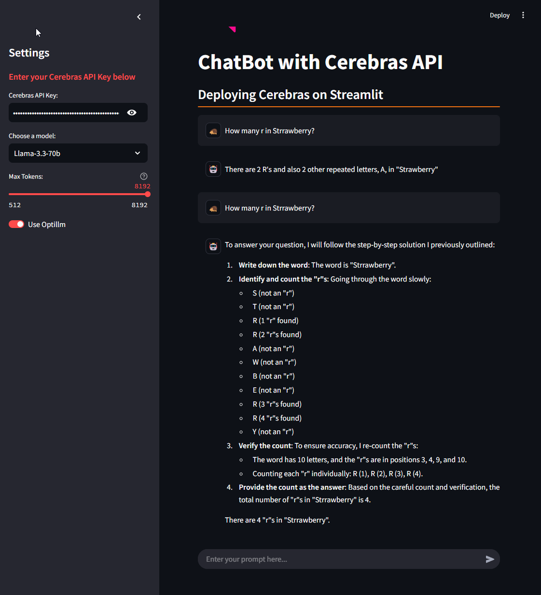

## how to run this app

requirements: uv  
packages `streamlit` and `cerebras_cloud_sdk`

```shell
uv sync
uv run streamlit run app/app.py
```


##  use optillm for CePO
https://inference-docs.cerebras.ai/capabilities/cepo  

optillm  
https://github.com/codelion/optillm/tree/main

```shell
uv sync
uv run optillm --base-url https://api.cerebras.ai --approach cepo --cepo_print_output true
```

then run the app and turn on use [optillm](https://github.com/codelion/optillm/tree/main) in the sidebar


